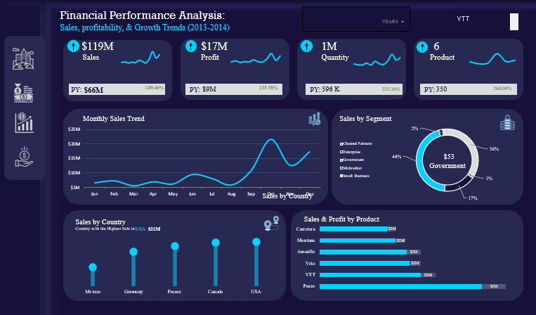
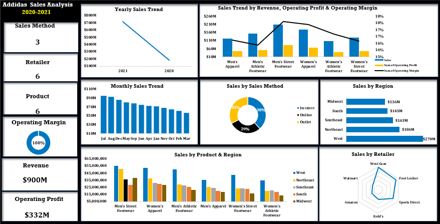
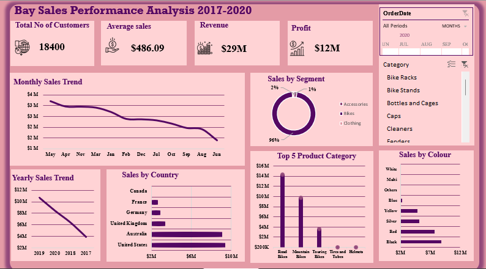

<!--Section 1: Introduce your self-->
## ABOUT ME

I’m Ekpite Jennifer, a data analyst skilled in Excel, Power BI, and SQL, focused on transforming data into actionable insights. I’ve worked across sales, operations, finance, and customer service, helping organizations improve performance and make data-driven decisions.

<!--Mention your top/relevant skills here - core and soft skills-->
## WHAT I DO

*As a Data Analyst Instructor, I train and mentor aspiring data analysts while supporting learners with practical, industry-relevant skills.*

**- ✅ Data Analysis Training & Mentorship.**

I teach hands-on data analysis using Excel and Power BI, guiding students from fundamentals to real-world business analysis through practical. 

**- ✅ Data Cleaning, Analysis & Visualization.**

I work with data to clean, transform, analyze, and visualize insights that support decision-making across sales, operations, finance, and customer service.

**- ✅ Reporting & Insight Communication.**

I help learners and stakeholders translate complex data into clear reports and dashboards that drive actionable, data-driven decisions.

<!--Section 2: List 3-4 key projects-->
## MY PROJECTS

*A glimpse of some of the projects I've worked on.*

**Financial Performance Analysis.**

Every successful business — whether it’s Amazon, Dangote Group, or a fast-growing startup — survives on one key ability:
👉 understanding its numbers and acting on them at the right time. This analysis uncovers sales performance, profitability trends, product impact, and regional contribution — helping decision-makers move from guesswork to data-driven strategy.

<a href="Financial Analysis.pdf">Download the Report here (pdf file)</a>
<!---[Read More]()--->

**Adidas Sales Performance Analysis (2020–2022).**

This project analyzes Adidas’ sales performance from 2020 to 2022 using Microsoft Excel to uncover trends in revenue, profitability, product performance, sales channels, retailers, and regional contribution.

<a href="Adidas_Sales_Dashboard_Report.pdf ">Download the Report here (pdf file)</a>

**Bay Sales Performance Analysis (2017–2020).**

This analysis transforms Bay’s historical sales data from 2017 to 2020 into a clear, visual, and actionable dashboard, enabling leadership to understand performance trends, identify key revenue drivers, and make informed strategic decisions.
 

<a href="Bay Sales Analysis.pdf">Download the Report here (pdf file)</a>

## CONTACT DETAILS

*Let’s connect and see how we can make a difference together!*
<table>
  <tbody>
    <tr>
      <td>📧</td>
      <td><a href="mailto:ekpitejennifer@gmail.com">ekpitejennifer@gmail.com</a></td>
    </tr>
    <tr>
      <td>📞</td>
      <td>(234) 706-539-7274</td>
    </tr>
    <tr>
      <td>📍</td>
      <td>Akure, Nigeria</td>
    </tr>
    <tr>
      <td>⬇️</td>
      <td><a href="Ekpite Jennifer Data Analysis.pdf">Download my CV</a></td>
    </tr>
    <tr>
      <td>🌐</td>
      <td><a href="https://www.linkedin.com/in/ekpite-jennifer">The things I do daily on LinkedIn</a></td>
    </tr>
    <tr>
      <td>📺</td>
      <td><a href="https://www.facebook.com/share/17oVXiApUW/">Connect with me on Facebook</a></td>
    </tr>
  </tbody>
</table>

   

